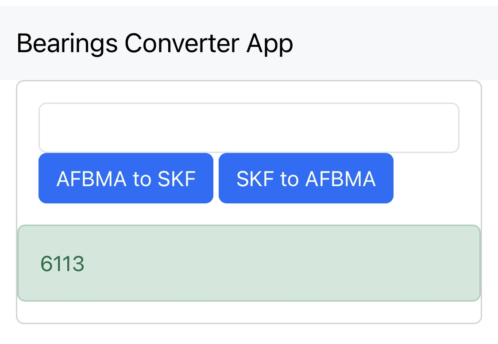

# Bearing-conversions app

A simple bearings nomenclature converter from AFBMA to SKF (and reversed).

## How it works:

1. Fill in the AFBMA bearing you want to convert into SKF (e.g., 65BC03)
2. Click to the button "AFBMA to SKF"
